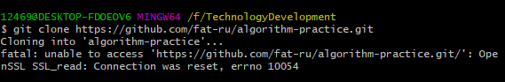

## 1、克隆代码时SSL连接失败
   
   - 正常网络访问github，会有访问失败的情况，需要开启vpn，vpn又导致克隆项目失败
   - **解决办法**：修改设置，解除ssl验证  
   `git config --global http.sslVerify "false"`
   
   
## 2、git bash和IDEA均无法push代码
   - **解决办法2**：git命令行在拉取/推送代码时并没有使用vpn代理，则配置代理。  
   - HTTP代理配置：   
   `git config --global http.proxy 127.0.0.1:7890`  
   `git config --global https.proxy 127.0.0.1:7890`  
   - Socket代理配置：  
   `git config --global http.proxy socks5 127.0.0.1:7890`  
   `git config --global https.proxy 127.0.0.1:7890`  
   
   - 命令中的主机号  
   （127.0.0.1）是使用的代理的主机号(自己电脑有vpn那么本机可看做访问github的代理主机)，即填入127.0.0.1即可，否则填入代理主机 ip(就是网上找的那个ip)
   - 命令中的端口号  
   （7890）为代理软件(代理软件不显示端口的话，就去Windows中的代理服务器设置中查看)或代理主机的监听IP，可以从代理服务器配置中获得，否则填入网上找的那个端口port 